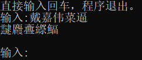

# djwcb翻译器

> 生僻字翻译器，灵感来源：[鴏槚䵋䴭㡀](https://www.bilibili.com/video/BV14N411f7rA/)

## 关于替换字

本项目会根据输入字拼音（含声调），替换成同拼音的复杂字，替换字典见[./tool/word_dict.csv](https://github.com/Loyage/djwcb-translator/blob/main/tool/word_dict.csv)。使用爬虫从[在线汉语字典](http://xh.5156edu.com/pinyi.html)爬取获得。具体方法见[get_dict.py](https://github.com/Loyage/djwcb-translator/blob/main/tool/get_dict.py)。

## 直接使用

[下载](https://github.com/Loyage/djwcb-translator/releases/download/1.0.0/djwcb_1_0_0.zip)，解压，直接运行即可。

效果：

## 自定义映射

修改tool文件夹下的word_dict.csv即可。

## 轻声，多音字怎么办？

建议单独拿出来，换一个同音字翻译一遍。
